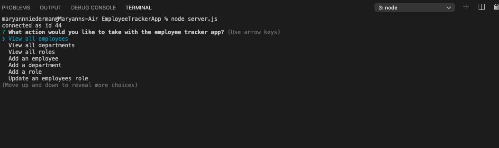

# EmployeeTrackerApp
# Employee Tracker Application


## Table of Contents

[*Description](#Description)

[* Requirements](#Requirements)

[* Installation](#Installation)

[* License](#License)

[* Contributing](#Contributing)

[* Credits](#Credits)


## Description

This repository houses a command line application Employee Tracker. This application utilizes NodeJS and MySQL to allow companies and employeers to easily modify, view and update employee information.


### Deployed Website

No website was deployed for this application.

## Requirements
```
As a business owner
I want to be able to view and manage the departments, roles, and employees in my company
So that I can organize and plan my business
```
## License

ISC

## Installation

-NPM Inquirer
-MySQL
-NodeJS.

See video walkthrough here: 

See repository here: https://github.com/meniederman/employeetrackerapp


## Contributing

Any feedback is encouraged and appreciated for future improvements.

## Credits

Maryann Niederman 2021

